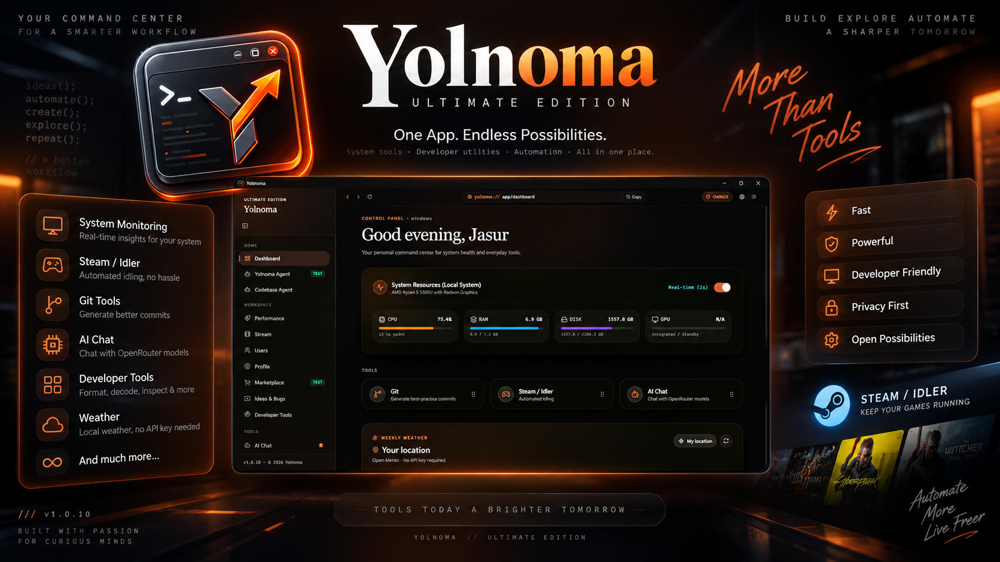
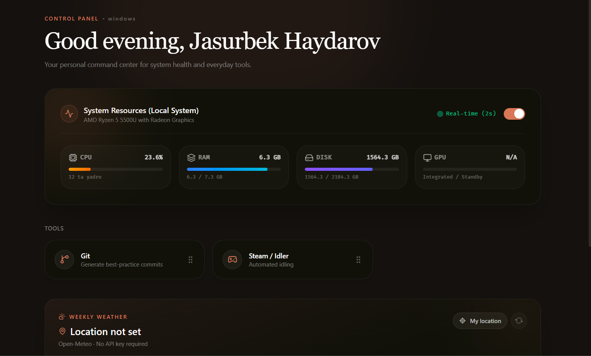
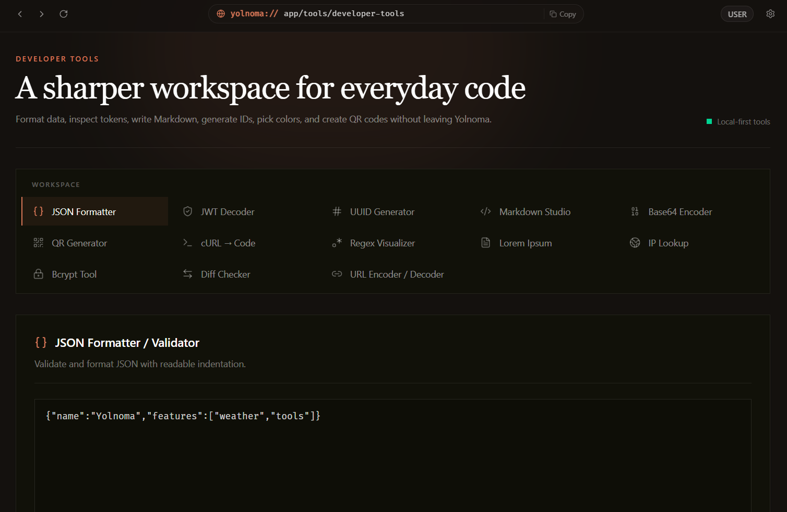
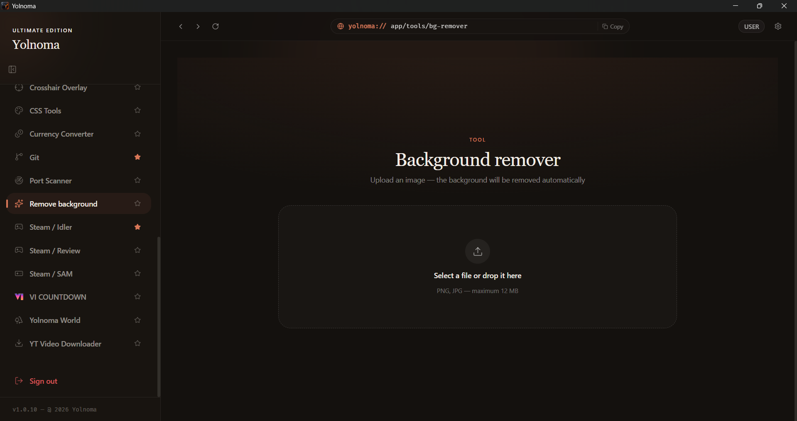

<div>

<h1 align="right">Yolnoma App</h1>
</div>



Yolnoma-App is an independent Windows desktop utility created and maintained
by **Jasurbek Haydarov** under **JK Software**. The project combines practical
developer tools, media utilities, and Steam-related workflows in one Tauri
desktop application.

> Yolnoma-App is not affiliated with, endorsed by, or sponsored by Valve
> Corporation or Steam.

## Project identity

Yolnoma-App is not a republished copy of another project. The application,
product direction, user interface, desktop shell, developer-tool collection,
media utilities, account-storage work, and integrations in this repository are
part of the Yolnoma project and are maintained by its own author and
contributors.

The repository also contains a clearly identified Steam integration derived from
or based on [Steam Game Idler](https://github.com/zevnda/steam-game-idler) by
**zevnda**. That upstream attribution is preserved because it is required for
those derived portions; it does not mean that Yolnoma-App is an official Steam
Game Idler release. See [THIRD-PARTY-NOTICES.md](./src-tauri/THIRD-PARTY-NOTICES.md) for
the detailed license and attribution information.

## About the author

**Jasurbek Haydarov** is the founder and developer and the
creator of Yolnoma-App. He develops practical desktop software for developers,
creators, and everyday users, with a focus on bringing useful workflows into a
single fast and accessible application.

Yolnoma-App is an actively evolving project. Contributions, responsible bug
reports, and constructive feedback are welcome through the repository.

## Tools and features

| Tool Name              | Description                                                      | Image                                                                              |
| ---------------------- | ---------------------------------------------------------------- | ---------------------------------------------------------------------------------- |
| **Dashboard**          | Yolnoma workspace and quick access to application tools.         |            |
| **Developer Tools**    | JWT, JSON, Markdown, UUID, IP lookup, QR, and related utilities. |            |
| **Background Remover** | Image background-removal workflow.                               |  |

Additional features include:

- AI Chat for general questions, coding help, and related workflows.
- Local AI chat history stored as JSON files on the user’s computer.
- Cleaner and CSS tools.
- JSON editing and viewing.
- Steam Idler and Steam achievement-management integrations.
- YouTube video downloader utilities.
- Port Scanner.
- Image, media, file, and everyday developer utilities.

The exact feature set may change between releases. Consult the source code and
release notes for the version you are using.

## Requirements

- Windows 10 or later for the full desktop feature set.
- Bun 1.4 or later for frontend development and dependency management.
- Rust and the Tauri prerequisites for desktop builds.
- A Steam account for Steam-related features.

Some integrations require their own API credentials. Never commit real keys,
passwords, session tokens, signing keys, or other secrets to this repository.
Use local environment variables or GitHub Actions secrets instead.

## Development

Install dependencies and start the development application:

```bash
bun install
bun run tauri dev
```

Build the frontend:

```bash
bun run build
```

Build the Tauri application locally:

```bash
bun run tauri build
```

The release workflow creates signed updater artifacts. The Tauri updater private
key must remain outside the repository and must be supplied through the
`TAURI_SIGNING_PRIVATE_KEY` and `TAURI_SIGNING_PRIVATE_KEY_PASSWORD` GitHub
Actions secrets.

## API keys and privacy

The `.env.example` file contains variable names only. Copy it to a local
configuration file and fill in values locally. Values beginning with `VITE_`
are intended for frontend builds and may be visible to users in the compiled
application; they must not be treated as server-side secrets.

Steam credentials and session data must be handled only through the supported
application flows. Users are responsible for complying with Steam's terms and
for protecting their accounts.

### AI Chat data flow

Yolnoma stores AI Chat conversations locally on the user’s computer as JSON
session files. On Windows, the current location is:

```text
%LOCALAPPDATA%\Yolnoma\accounts\<user-id>\ai-chat\sessions\<session-id>.json
```

The chat history is not uploaded to a Yolnoma-owned database. However, when a
user sends a prompt, the prompt, selected project context, and required request
metadata are sent to the configured AI provider—currently OpenRouter—in order
to generate a response. Therefore, do not send passwords, private keys, access
tokens, confidential source code, or other sensitive information unless you
have reviewed and accepted the provider’s terms and privacy policy. Yolnoma
does not provide a shared server-side AI key; the user supplies their own key.

For the full security boundaries, data-flow notes, credential guidance, and
vulnerability-reporting process, see [SECURITY.md](./SECURITY.md).

## License

Yolnoma-App original code is source-available under the
[Elastic License 2.0](./LICENSE), Copyright (c) 2026 Jasurbek Haydarov and
contributors, except where a file or notice identifies another license.

This repository includes third-party components that remain under their own
licenses. Read [THIRD-PARTY-NOTICES.md](./THIRD-PARTY-NOTICES.md) before
redistributing source or binaries.

Elastic License 2.0 is source-available and is not an OSI-approved open-source
license. It permits use, modification, and redistribution subject to its
terms, including restrictions on hosted services and license-key functionality.

## Acknowledgements

Thank you to the authors and maintainers of Steam Game Idler, SteamKit2, Tauri,
React, and the other open-source projects that make Yolnoma-App possible.

## Security

Do not report private credentials in a public issue. For a suspected security
problem, contact the repository maintainers privately before disclosure.
See [SECURITY.md](./SECURITY.md) for the complete security policy.
