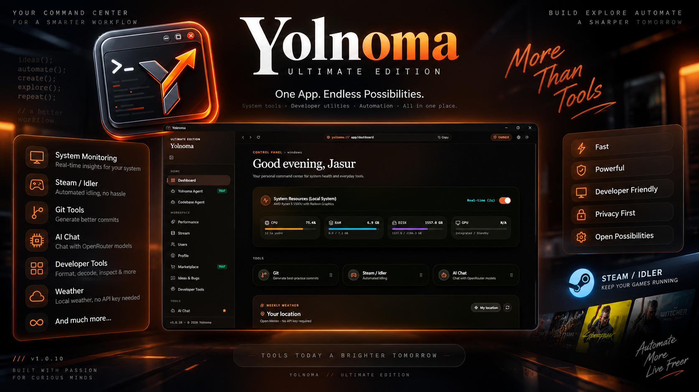
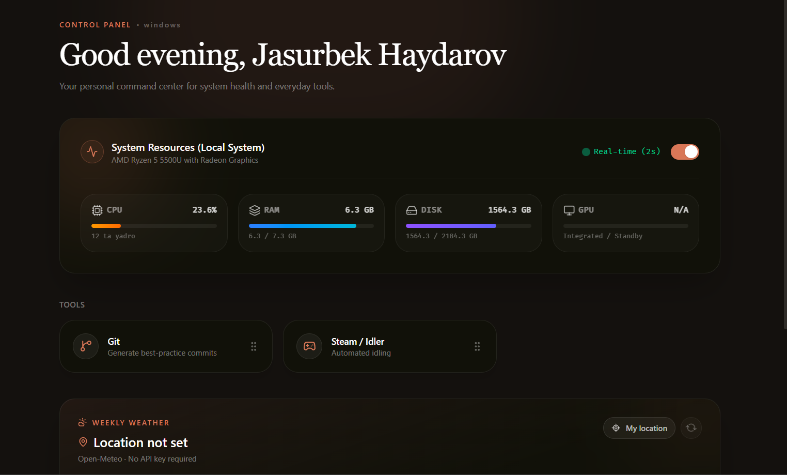
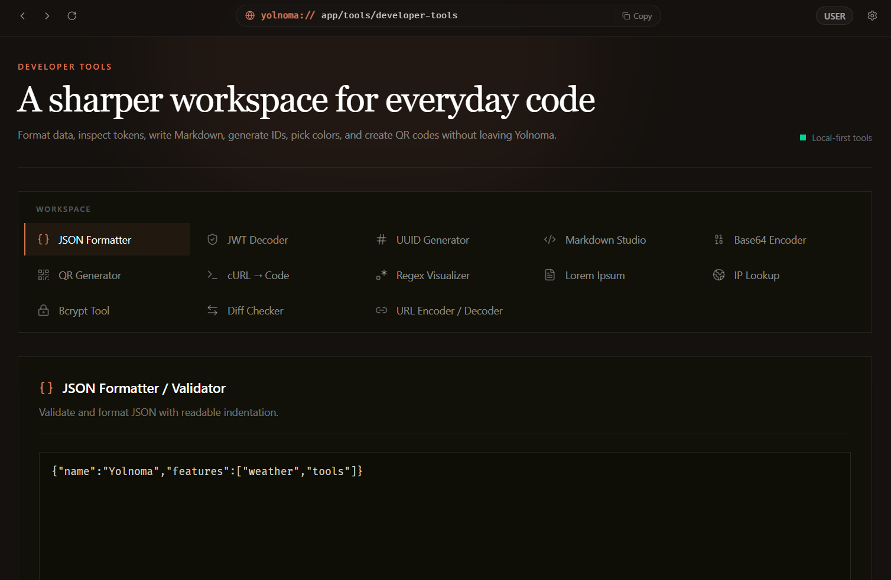
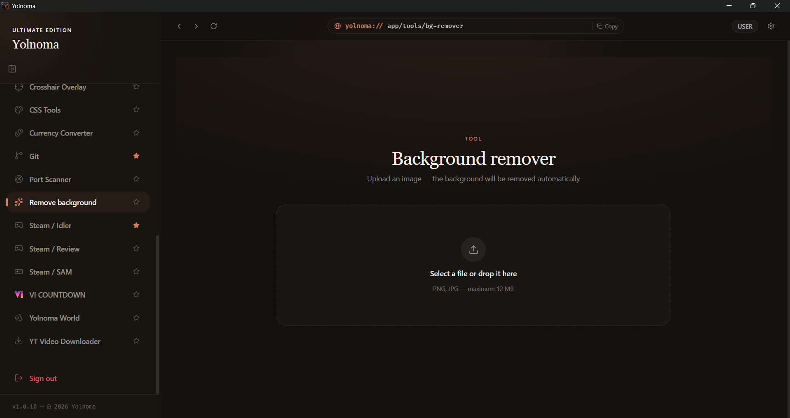

<div align="center">

  <h1>Yolnoma-App</h1>
  <p><strong>One focused desktop workspace for developers, creators, and everyday power users.</strong></p>
  <p>
    <a href="https://github.com/hexjasur/Yolnoma-App/releases">Releases</a> ·
    <a href="https://github.com/hexjasur/Yolnoma-App/issues">Issues</a> ·
    <a href="CONTRIBUTING.md">Contributing</a>
  </p>
  <p align="center">
    <a href="README.md"><b>English</b></a> ·
    <a href="docs/locales/README.ru.md">Русский</a> ·
    <a href="docs/locales/README.zh.md">中文</a>
  </p>
</div> <p align="center">
  
</p>

**Yolnoma-App** brings practical developer tools, network inspection, media utilities, image workflows, AI workspaces, and Steam-related tools into one native desktop application. Instead of switching between many small browser utilities, you can keep frequently used workflows together in a single [Tauri](https://tauri.app/)-powered workspace.

> Yolnoma-App is an independent project by Jasurbek Haydarov under JK Software. It is not affiliated with, endorsed by, or sponsored by Valve Corporation or Steam.

# Why Yolnoma?

Most utility workflows are fragmented across browser tabs, standalone scripts, and one-purpose applications. Yolnoma is built around a different idea: a practical desktop toolbox that grows with the way you work.

- One app, many workflows — developer, network, media, image, AI, file, and gaming utilities in one place.

- Native desktop foundation — React and TypeScript in the UI, Tauri v2 and Rust at the desktop boundary.

- Workspace-oriented navigation — tools are grouped into focused pages and tabbed workspaces instead of one crowded dashboard.

- Local-first application data — account configuration and AI chat sessions are stored on the user's device; external AI requests go to the provider selected by the feature.

- Actively evolving — new utilities, integrations, and workspace improvements are added as the project develops.

# What you can do

| Workspace             | What you can do                                                                                                                        |
| --------------------- | -------------------------------------------------------------------------------------------------------------------------------------- |
| **Developer tools**   | Format JSON, decode JWTs, convert cURL requests, compare text, work with Git, and use encoding utilities.                              |
| **Network & domains** | Inspect DNS records, subdomains, HTTP headers, SSL-related information, and selected ports on authorized targets.                      |
| **Desktop utilities** | Clean selected caches, monitor system resources, convert currencies, configure a crosshair overlay, and explore Yolnoma World.         |
| **AI workspace**      | Chat with configured OpenRouter models, generate database diagrams, and assist with project documentation and code-oriented workflows. |
| **Steam & gaming**    | Use selected Steam-related utilities, review game information, and access achievement-related integrations.                            |

---

## Technology

| Layer           | Technology                                         |
| --------------- | -------------------------------------------------- |
| Desktop shell   | [Tauri v2](https://tauri.app/)                     |
| Frontend        | React, TypeScript, Vite                            |
| Styling         | Tailwind CSS                                       |
| Native layer    | Rust                                               |
| State and data  | Zustand, TanStack Query, local application storage |
| Package manager | [Bun](https://bun.sh/)                             |
| Testing         | Vitest and Testing Library                         |

The high-level architecture is documented in [ARCHITECTURE.md](docs/ARCHITECTURE.md).

---

## Table of contents

- [Highlights](#highlights)
- [Supported languages](#supported-languages)
- [Screenshots](#screenshots)
- [Requirements](#requirements)
- [Getting started](#getting-started)
- [Available scripts](#available-scripts)
- [Configuration and secrets](#configuration-and-secrets)
- [Privacy and data flow](#privacy-and-data-flow)
- [Project identity](#project-identity)
- [About the author](#about-the-author)
- [Acknowledgements](#acknowledgements)
- [Security](#security)
- [License](#license)
- [Contributing](#contributing)

## Highlights

- 🖥️ **One desktop app** for developer, media, and everyday utilities.
- ⚡ **Fast native shell** built with Tauri, React, and Bun.
- 🌐 **Multi-language support** — available in English, Russian (Русский), Spanish (Español), and Chinese (中文).
- 🔐 **Local-first data** — AI chat history and account data stay on your machine.
- 🧩 **Extensible toolset** — new tools are added continuously between releases.
- 🤖 **Bring your own AI key** — no shared server-side key, no vendor lock-in.

## Supported languages

Yolnoma-App features built-in internationalization with instant in-app switching from the navbar:

- **English** (`en`) — Default language (Full interface)
- **Russian** (`ru` / Русский) — Full interface localization
- **Spanish** (`es` / Español) — Navigation, sidebar, and dashboard localization
- **Chinese** (`zh` / 中文) — Navigation, sidebar, and dashboard localization

## Screenshots

| Dashboard                                                                 | Developer Tools                                                           | Background Remover                                                                  |
| ------------------------------------------------------------------------- | ------------------------------------------------------------------------- | ----------------------------------------------------------------------------------- |
|  |  |  |

## Requirements

Before running or building Yolnoma-App locally, ensure your system meets the following requirements:

### Operating System

- **Windows 10 / 11** (64-bit) recommended for full desktop feature support.

### Development Toolchain

1. **[Bun](https://bun.sh/) (v1.4+)** or **Node.js (v18+)**:
   - Used for frontend dependency management and running development scripts.
2. **[Rust Toolchain](https://www.rust-lang.org/tools/install)** (`rustc`, `cargo`):
   - Tauri v2 requires Rust to compile the native backend (`stable` channel recommended).
   - Install via `rustup`:
     ```bash
     rustup default stable
     ```
3. **[Tauri v2 Prerequisites](https://v2.tauri.app/start/prerequisites/)**:
   - **Windows:** Requires **Microsoft Visual Studio C++ Build Tools** (include "Desktop development with C++" workload) and **WebView2 Runtime**.

Some integrations require their own API credentials (see
[Configuration and secrets](#configuration-and-secrets)).

## Getting started

```bash
# 1. install dependencies
bun install

# 2. copy the environment template and fill in the values you need
cp .env.example .env

# 3. start the development application
bun run tauri dev
```

## Available scripts

| Command             | Purpose                                          |
| ------------------- | ------------------------------------------------ |
| `bun run td`        | Start the Tauri desktop app in development mode. |
| `bun run dev`       | Start the Vite frontend development server.      |
| `bun run typecheck` | Run TypeScript checks.                           |
| `bun run lint`      | Run ESLint.                                      |
| `bun run test`      | Run the Vitest test suite.                       |
| `bun run build`     | Build the frontend bundle.                       |
| `bun run tb`        | Build the desktop application.                   |
| `bun run check`     | Run the project's combined validation commands.  |

The release workflow creates signed updater artifacts. The Tauri updater private
key must stay **outside** the repository and be supplied through the
`TAURI_SIGNING_PRIVATE_KEY` and `TAURI_SIGNING_PRIVATE_KEY_PASSWORD` GitHub
Actions secrets.

## Releases

Windows desktop releases are built through GitHub Actions when a v* tag is pushed. The release workflow produces the signed Windows installer and updater artifacts when the repository's release secrets are configured.

- [View Yolnoma releases](https://github.com/hexjasur/Yolnoma-App/releases)

- [Read the release guide](docs/RELEASES.md)

Android builds are currently test releases and may not include the complete desktop feature set.

## Configuration and secrets

- `.env.example` contains **variable names only**. Copy it locally and fill in
  your own values.
- Values prefixed with `VITE_` are embedded into the frontend build and are
  therefore **visible in the compiled application** — never treat them as
  server-side secrets.
- Never commit real API keys, passwords, session tokens, or signing keys. Use
  local environment files or GitHub Actions secrets.

## Privacy and data flow

AI Chat conversations are stored **locally** on your computer as JSON session
files. On Windows the current location is:

```text
%LOCALAPPDATA%\Yolnoma\accounts\<user-id>\ai-chat\sessions\<session-id>.json
```

When you send a prompt, the prompt, the selected project context, and the
required request metadata are transmitted to the configured AI provider
(currently **OpenRouter**) so that a response can be generated. Chat history is
**not** uploaded to a Yolnoma-owned database, and Yolnoma does not provide a
shared AI key — you supply your own.

> ⚠️ Do not send passwords, private keys, access tokens, or confidential source
> code unless you have reviewed and accepted the provider's terms and privacy policy.

For the complete security boundaries, data-flow notes, credential guidance, and
vulnerability-reporting process, see [SECURITY.md](./SECURITY.md).

## Project identity

Yolnoma-App is **not** a republished copy of another project. The application,
product direction, user interface, desktop shell, developer-tool collection,
media utilities, account-storage work, and integrations in this repository are
part of the Yolnoma project and are maintained by its own author and
contributors.

The repository does contain a clearly identified Steam integration derived from
or based on [Steam Game Idler](https://github.com/zevnda/steam-game-idler) by
**zevnda**. That upstream attribution is preserved because it is required for
those derived portions; it does not mean that Yolnoma-App is an official Steam
Game Idler release. See
[THIRD-PARTY-NOTICES.md](./src-tauri/THIRD-PARTY-NOTICES.md) for detailed
license and attribution information.

## Acknowledgements

Thank you to the authors and maintainers of Steam Game Idler, SteamKit2, Tauri,
React, and the many other open-source projects that make Yolnoma-App possible.

## Security

Do not report private credentials in a public issue. For a suspected security
problem, contact the maintainers privately before disclosure — see
[SECURITY.md](./SECURITY.md) for the full policy.

## Contributing

Issues, ideas, bug reports, and pull requests are welcome. A useful contribution can be a new workspace, a reliability fix, improved documentation, a test, or a clearer user flow.

Before contributing:

1. Read [CONTRIBUTING.md](CONTRIBUTING.md).

2. Review [ARCHITECTURE.md](docs/ARCHITECTURE.md).

3. Check the security and third-party licensing requirements.

4. Keep changes focused and include tests or verification where practical.

5. Include screenshots for meaningful UI changes.

If Yolnoma is useful to you, consider starring the repository, opening an issue with feedback, or sharing a workflow that you would like to see supported.

## License

Original Yolnoma-App code is source-available under the **Elastic License 2.0**, Copyright (c) 2026 Jasurbek Haydarov and contributors. This is not an OSI-approved open-source license; review its restrictions before redistributing or offering the software as a hosted service.

Third-party components and derived code retain their own licenses and attribution requirements. See [THIRD-PARTY-NOTICES.md](src-tauri/THIRD-PARTY-NOTICES.md).

## Author

Jasurbek Haydarov — founder and developer of Yolnoma-App.

- GitHub: [@hexjasur](https://github.com/hexjasur)

- Project: [hexjasur/Yolnoma-App](https://github.com/hexjasur/Yolnoma-App)
